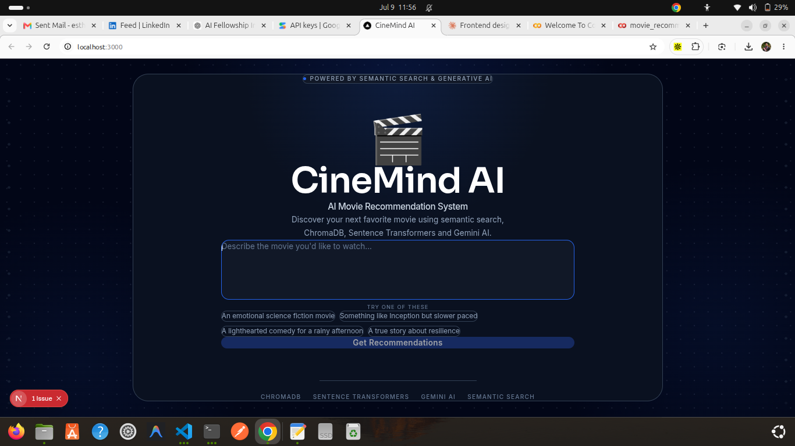

# 🎬 CineMind AI

An AI-powered movie recommendation system that understands natural language and recommends movies using **semantic search**, **Sentence Transformers**, **ChromaDB**, and **Google Gemini AI**.

Instead of relying on keyword matching, CineMind AI understands the meaning behind a user's request and explains why each movie was recommended.

---

## ✨ Features

* 🔍 Semantic movie search using Sentence Transformers
* 🎥 Natural language movie recommendations
* 🧠 AI-generated explanations using Gemini AI
* ⚡ Fast vector similarity search with ChromaDB
* 🎨 Modern Next.js frontend
* 🚀 FastAPI backend
* 📱 Responsive user interface

---

## 🏗️ Architecture

```text
                User Query
                     │
                     ▼
            Sentence Transformer
                     │
                     ▼
             Query Embedding
                     │
                     ▼
                ChromaDB Search
                     │
                     ▼
         Top Similar Movie Results
                     │
                     ▼
             Google Gemini AI
                     │
                     ▼
      Personalized Recommendation Explanation
                     │
                     ▼
                Next.js Frontend
```

---

## 🛠 Tech Stack

### Frontend

* Next.js
* TypeScript
* Tailwind CSS
* Axios
* Framer Motion

### Backend

* FastAPI
* Python
* ChromaDB
* Sentence Transformers
* Google Gemini API
* Pandas

### AI & Machine Learning

* all-MiniLM-L6-v2
* Semantic Search
* Vector Embeddings
* Generative AI

---

## 📸 Screenshots

### Home Page



### Recommendations


---

## 📂 Project Structure

```text
movie-recommendation-agent
│
├── backend
│   ├── app.py
│   ├── recommendation.py
│   ├── load_movies.py
│   ├── database.py
│   ├── embeddings.py
│   ├── gemini_service.py
│
├── frontend
│   ├── app
│   ├── components
│   ├── services
│   └── types
│
├── screenshots
│
├── data
│
└── README.md
```

---

## 🚀 Installation

### Clone the repository

```bash
git clone https://github.com/yourusername/movie-recommendation-agent.git

cd movie-recommendation-agent
```

---

### Backend

```bash
cd backend

python -m venv venv

source venv/bin/activate

pip install -r requirements.txt
```

Create a `.env` file.

```env
GEMINI_API_KEY=your_api_key_here
```

---

### Download the Dataset

Download the TMDB 5000 Movie Dataset from Kaggle.

Place these files inside the `data/` folder:

```
tmdb_5000_movies.csv

tmdb_5000_credits.csv
```

---

### Load Movies into ChromaDB

```bash
python load_movies.py
```

---

### Run the Backend

```bash
uvicorn app:app --reload
```

---

### Frontend

```bash
cd frontend

npm install

npm run dev
```

Visit:

```
http://localhost:3000
```

---

## API

### POST `/recommend`

Example Request

```json
{
  "query": "Romantic movie"
}
```

Example Response

```json
{
  "query": "Romantic movie",
  "recommendations": [...],
  "explanation": "..."
}
```

---

## Future Improvements

* Movie poster support
* Genre filtering
* Year filtering
* Actor filtering
* Streaming platform recommendations
* User authentication
* Favorites and watchlists
* Hybrid recommendation engine
* LLM-powered conversational assistant

---

## Author

**Esther Nyambura Kariuki**

Entry-Level Software & Data Engineer

GitHub:
https://github.com/esthernkariuki

LinkedIn:
https://www.linkedin.com/in/esther-nyambura-kariuki/

---
