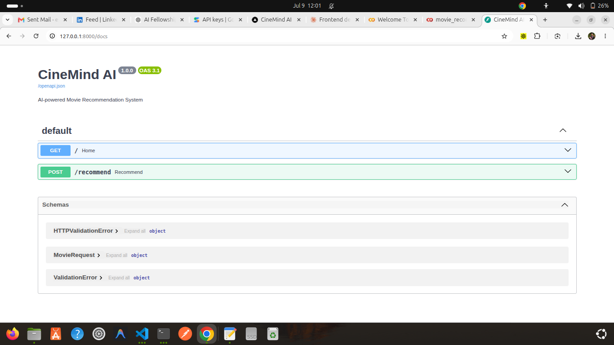

# 🎬 CineMind AI

An AI-powered movie recommendation system that understands natural language and recommends movies using semantic search, vector embeddings, ChromaDB, and Google's Gemini AI.

---

## ✨ Features

- 🔍 Search movies using natural language
- 🤖 AI-generated explanations for every recommendation
- 🧠 Semantic search using Sentence Transformers
- 💾 Vector database powered by ChromaDB
- ⚡ FastAPI backend
- 🎨 Modern Next.js frontend
- 📱 Responsive user interface

---

## 📸 Screenshots

### Home Page

> Add a screenshot here


### Recommendations

> Add a screenshot here


### FastAPI Documentation



---

# 🏗 Architecture

```
                 Next.js Frontend
                        │
                        ▼
                 FastAPI Backend
                        │
        ┌───────────────┴───────────────┐
        ▼                               ▼
 Sentence Transformers             Gemini AI
        │
        ▼
     ChromaDB
        │
        ▼
 Movie Dataset
```

---

# 🚀 Tech Stack

### Frontend

- Next.js
- React
- TypeScript
- Tailwind CSS
- Axios

### Backend

- FastAPI
- Python
- Sentence Transformers
- ChromaDB
- Google Gemini API

### AI

- Semantic Search
- Vector Embeddings
- Retrieval-Augmented Recommendation

---

# 📂 Project Structure

```
movie-recommendation-agent/

├── backend/
│   ├── app.py
│   ├── recommendation.py
│   ├── database.py
│   ├── embeddings.py
│   ├── gemini_service.py
│   └── requirements.txt
│
├── frontend/
│   ├── app/
│   ├── components/
│   ├── services/
│   └── types/
│
├── notebook/
│   └── movie_recommendation_agent.ipynb
│
├── screenshots/
│
└── README.md
```

---

# ⚙ Installation

## Clone Repository

```bash
git clone git@github.com:esthernkariuki/movie-recommendation-agent.git

cd movie-recommendation-agent
```

---

## Backend

```bash
cd backend

python3 -m venv venv

source venv/bin/activate

pip install -r requirements.txt

uvicorn app:app --reload
```

Backend runs at

```
http://127.0.0.1:8000
```

Swagger Docs

```
http://127.0.0.1:8000/docs
```

---

## Frontend

```bash
cd frontend

npm install

npm run dev
```

Frontend runs at

```
http://localhost:3000
```

---

# 💡 Example Prompt

```
I want an emotional science fiction movie with space travel.
```

---

# 🧠 How It Works

1. User enters a movie description.
2. FastAPI receives the request.
3. Sentence Transformers create embeddings.
4. ChromaDB performs semantic similarity search.
5. Gemini AI explains why the recommended movies match the user's request.
6. The frontend displays recommendations and AI explanations.

---

# 🔮 Future Improvements

- Movie posters
- User authentication
- Favorites and watchlist
- Genre filters
- Streaming platform integration
- Recommendation history
- Dark/Light mode

---

# 👩‍💻 Author

**Esther Nyambura Kariuki**

- GitHub: https://github.com/esthernkariuki
- LinkedIn: https://www.linkedin.com/in/esther-nyambura-kariuki/

---

⭐ If you found this project interesting, feel free to star the repository.